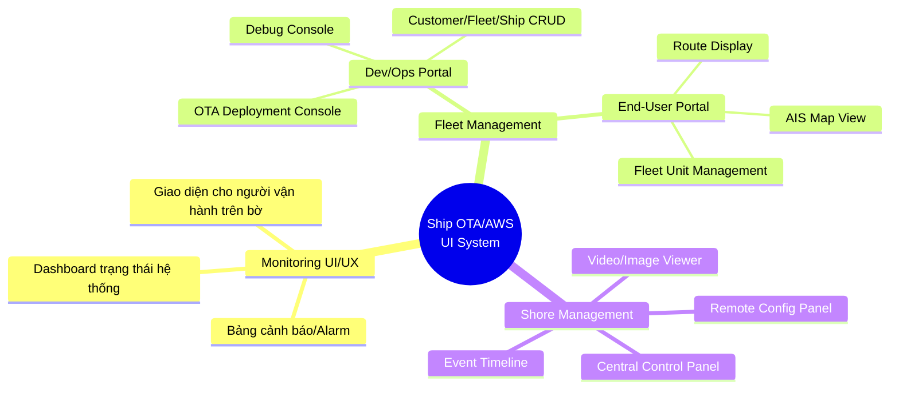
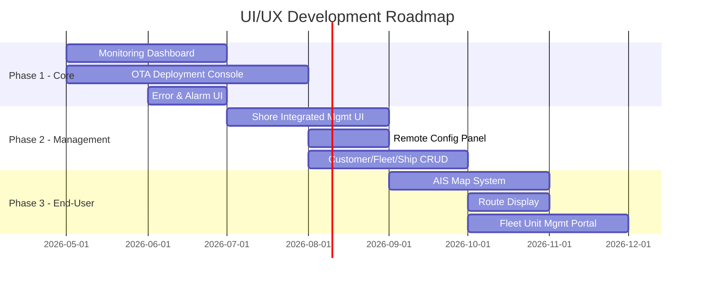

# 📋 Phân Tích BA: Tài liệu Yêu cầu Dịch vụ OTA/AWS cho Tàu biển

> **Tài liệu gốc:** 선박용*OTA_AWS*요구기능\_정리.pdf (Tổng hợp yêu cầu chức năng OTA/AWS cho tàu biển)
> **Ngày phân tích:** 2026-04-23
> **Vai trò:** Business Analyst
> **Ngôn ngữ gốc:** Tiếng Hàn → Dịch sang Tiếng Việt

---

## 1. Tổng quan tài liệu

Tài liệu này tổng hợp các yêu cầu chức năng cho hệ thống **OTA (Over-The-Air) update** và **AWS cloud services** phục vụ tàu biển. Nội dung được chia thành 2 phần chính:

- **Phần A:** Các hạng mục đã được thống nhất trước đó (기 협의된 사항)
- **Phần B:** Các đề xuất mới nhất — chi tiết bổ sung (최신 제안 사항 상세)

---

## 2. Nội dung chi tiết (Dịch & Phân tích)

### 📌 Phần A — Các hạng mục đã thống nhất

#### ① Monitoring UI/UX (Giao diện giám sát)

| #   | Hạng mục                                                   | Mô tả                                                                |
| --- | ---------------------------------------------------------- | -------------------------------------------------------------------- |
| a   | Xem xét người vận hành trên bờ                             | UI cần thiết kế cho người điều hành tại trung tâm điều khiển trên bờ |
| b   | Cải thiện khả năng hiển thị trạng thái hệ thống & cảnh báo | Nâng cao tính trực quan của trạng thái hệ thống và các alarm         |

#### ② OTA (Cập nhật qua mạng)

| #     | Hạng mục                  | Mô tả                                  |
| ----- | ------------------------- | -------------------------------------- |
| a     | Triển khai OTA            |                                        |
| a-i   | Kho lưu trữ Git           | Repository quản lý source code         |
| a-ii  | ArgoCD & GitOps           | CI/CD pipeline cho deployment          |
| a-iii | Phân phối container image | Docker layer-based, P2P registry, v.v. |

#### ③ Xây dựng hệ thống quản lý tích hợp trên bờ (육상 통합 관리)

| #   | Hạng mục                          | Mô tả                                  |
| --- | --------------------------------- | -------------------------------------- |
| a   | Truyền video về trung tâm trên bờ | Video streaming từ tàu → bờ            |
| b   | Điều khiển tập trung              | Giám sát & quản lý đồng thời nhiều tàu |

#### ④ Trang quản lý Hạm đội (Fleet Management Page)

| #   | Hạng mục                         | Mô tả                                                 |
| --- | -------------------------------- | ----------------------------------------------------- |
| a   | Trạng thái tàu real-time         | Dashboard hiển thị trạng thái tàu theo thời gian thực |
| b   | Video feed real-time             | ⚠️ Đánh dấu (x) — có thể chưa khả thi hoặc bị loại bỏ |
| c   | Theo dõi sự cố & dữ liệu sự kiện | Event tracking & incident management                  |

#### ⑤ Cải thiện kiến trúc hệ thống

| #   | Hạng mục                              | Mô tả                                               |
| --- | ------------------------------------- | --------------------------------------------------- |
| a   | Pipeline truyền thông dữ liệu + video | Data + Video communication pipeline                 |
| b   | Onboard + Onshore                     | Kiến trúc kết nối giữa hệ thống trên tàu và trên bờ |

---

### 📌 Phần B — Đề xuất mới nhất (Chi tiết bổ sung)

#### ① Monitoring UI/UX

> _(Không có chi tiết bổ sung mới trong phần này — giữ nguyên các hạng mục ở Phần A)_

#### ② OTA — Chi tiết bổ sung

**a. Triển khai OTA:**

| #   | Hạng mục                               | Chi tiết                                                                                        |
| --- | -------------------------------------- | ----------------------------------------------------------------------------------------------- |
| i   | OTA Controller trên Greengrass         | Custom component trong AWS IoT Greengrass để quản lý OTA                                        |
| ii  | Bộ tải xuống thích ứng băng thông mạng | • Phát hiện băng thông • Thực thi/dừng download theo băng thông • Download AI model, v.v. |
| iii | Tách quy trình download / deploy image | Container image download xong mới deploy (2 bước riêng biệt)                                    |

#### ③ Hệ thống quản lý tích hợp trên bờ — Chi tiết bổ sung

**a. Truyền video phân cấp theo mức sự kiện:**

| #   | Loại dữ liệu      | Khi nào?                                     | Hành vi                                       |
| --- | ----------------- | -------------------------------------------- | --------------------------------------------- |
| i   | Video (영상)      | Sự kiện cháy/khói                            | **Tức thì** (즉각적)                          |
|     |                   | HiCAMS lưu trữ video cho thu thập dữ liệu    | **Không tức thì** (비즉각적) — phát triển sau |
| ii  | Hình ảnh (이미지) | Mọi sự kiện                                  | **Tức thì**                                   |
|     |                   | HiCAMS lưu trữ hình ảnh cho thu thập dữ liệu | **Không tức thì** — phát triển sau            |
| iii | Event metadata    | Mọi sự kiện                                  | **Tức thì**                                   |

**b. Điều khiển tập trung:**

| #   | Hạng mục                                                    | Chi tiết                                                                                           |
| --- | ----------------------------------------------------------- | -------------------------------------------------------------------------------------------------- |
| i   | Custom component Greengrass (Shadow)                        | • Trạng thái/hiện trạng server theo từng tàu • Trạng thái mạng • Trạng thái vận hành dịch vụ |
| ii  | Cấu trúc điều khiển đồng thời nhiều tàu                     | IOT Jobs (MQTT) để điều khiển hàng loạt — chuẩn bị cho khi số tàu tăng lên                         |
| iii | Cấu trúc cho nhân viên non-dev có thể deploy/debug đơn giản | • Xem error message • Alarm khi phát hiện bất thường (từ góc độ deploy/vận hành)                |
| iv  | Chức năng cài đặt từ xa khác                                | • Điều khiển/cấu hình model từ xa • Điều khiển biến DB từ xa (ví dụ: `decision_threshold`)      |

#### ④ Trang quản lý Hạm đội — Chi tiết bổ sung

> [!IMPORTANT]
> Cần điều chỉnh thứ tự ưu tiên phát triển (개발 우선순위 조정 필요)

**a. Dành cho Dev/Ops (Quản lý khách hàng & Deploy/Troubleshooting):**

| #   | Hạng mục                       | Chi tiết                                                                                                                                                       |
| --- | ------------------------------ | -------------------------------------------------------------------------------------------------------------------------------------------------------------- |
| i   | Debug đơn giản                 | Công cụ debug cơ bản                                                                                                                                           |
| ii  | OTA deploy & cài đặt mới       | • Deploy hàng loạt / theo đội tàu / theo từng tàu • Hiện trạng deploy từng tàu • Lịch sử deploy • Bộ điều khiển deploy • Cài đặt & đăng ký tàu mới |
| iii | Secure tunneling               | Cho trường hợp khẩn cấp                                                                                                                                        |
| iv  | Quản lý Khách hàng/Đội tàu/Tàu | • Đăng ký mới • Cài đặt quyền hạn                                                                                                                           |

**b. Dành cho người dùng cuối (Quản lý đội tàu):**

| #   | Hạng mục                             | Ghi chú                                |
| --- | ------------------------------------ | -------------------------------------- |
| i   | Hệ thống bản đồ dựa trên AIS         | ⚠️ Cần xác nhận khả thi                |
| ii  | Hệ thống hiển thị hải trình          | ⚠️ Cần xác nhận khả thi                |
| iii | Cấu trúc quản lý theo đơn vị đội tàu | Khách hàng có thể sở hữu nhiều đội tàu |

#### ⑤ Cải thiện kiến trúc hệ thống

> _(Không có chi tiết bổ sung cụ thể — đánh dấu "-")_

---

## 3. 🎯 Phân tích UI/UX — Các việc cần làm

### 3.1 Tổng quan các màn hình / module UI cần phát triển

### 3.2 Chi tiết từng hạng mục UI/UX cần triển khai

#### 🔹 Module 1: Monitoring Dashboard (Ưu tiên CAO)

| Việc cần làm                           | Mô tả                                                         | Ghi chú UI/UX                                            |
| -------------------------------------- | ------------------------------------------------------------- | -------------------------------------------------------- |
| Thiết kế Dashboard trạng thái hệ thống | Hiển thị trạng thái server, mạng, dịch vụ cho từng tàu        | Cần card-based layout, color-coded status (xanh/vàng/đỏ) |
| Thiết kế bảng Alarm/Cảnh báo           | Hiển thị alarm khi phát hiện bất thường trong deploy/vận hành | Notification center với severity levels, auto-scroll     |
| Tối ưu cho người vận hành trên bờ      | UI phù hợp cho màn hình lớn tại trung tâm điều khiển          | Responsive cho multi-monitor, information density cao    |

#### 🔹 Module 2: OTA Deployment Console (Ưu tiên CAO)

| Việc cần làm         | Mô tả                                                                 | Ghi chú UI/UX                                           |
| -------------------- | --------------------------------------------------------------------- | ------------------------------------------------------- |
| Deploy Controller UI | Giao diện điều khiển deploy với 3 cấp: hàng loạt / đội tàu / từng tàu | Wizard-style flow, confirmation dialog, rollback option |
| Deploy Status View   | Hiện trạng deploy theo từng tàu (progress, success, failed)           | Real-time progress bar, status badges                   |
| Deploy History       | Lịch sử deploy với filter/search                                      | Table view với pagination, filter theo tàu/ngày/kết quả |
| Ship Registration    | Đăng ký & cài đặt tàu mới                                             | Form wizard, validation, confirmation                   |
| Bandwidth Indicator  | Hiển thị trạng thái băng thông mạng ảnh hưởng đến OTA download        | Gauge/indicator kết hợp trong deploy view               |

#### 🔹 Module 3: Shore Integrated Management (Ưu tiên CAO)

| Việc cần làm                   | Mô tả                                                                      | Ghi chú UI/UX                                           |
| ------------------------------ | -------------------------------------------------------------------------- | ------------------------------------------------------- |
| Event-based Video/Image Viewer | Xem video/ảnh theo cấp sự kiện (cháy/khói → tức thì, khác → không tức thì) | Media player tích hợp, event-tagged timeline            |
| Event Timeline                 | Hiển thị timeline sự kiện với metadata                                     | Filterable timeline, zoom in/out, click-to-detail       |
| Central Control Panel          | Điều khiển tập trung: gửi lệnh đến nhiều tàu cùng lúc                      | Bulk action UI, selection grid, MQTT command builder    |
| Error Message Viewer           | Hiển thị error messages từ các tàu                                         | Log viewer style, severity filter, search               |
| Remote Config Panel            | Cấu hình từ xa: model, decision_threshold, DB variables                    | Form-based config, diff view (trước/sau), instant apply |

#### 🔹 Module 4: Fleet Management — End-User Portal (Ưu tiên TRUNG BÌNH)

| Việc cần làm          | Mô tả                                            | Ghi chú UI/UX                                      |
| --------------------- | ------------------------------------------------ | -------------------------------------------------- |
| AIS-based Map System  | Bản đồ hiển thị vị trí tàu theo dữ liệu AIS      | Leaflet/Mapbox integration, ship icons, clustering |
| Route Display System  | Hiển thị hải trình tàu trên bản đồ               | Polyline overlay, historical route playback        |
| Fleet Unit Management | Quản lý theo cấu trúc Khách hàng → Đội tàu → Tàu | Tree view / nested accordion, drag-drop reorg      |
| Real-time Ship Status | Trạng thái tàu thời gian thực cho end-user       | Simplified card view, key metrics only             |

#### 🔹 Module 5: Customer & Permission Management (Ưu tiên TRUNG BÌNH)

| Việc cần làm        | Mô tả                                          | Ghi chú UI/UX            |
| ------------------- | ---------------------------------------------- | ------------------------ |
| Customer CRUD       | Đăng ký mới, chỉnh sửa, xóa khách hàng         | Standard CRUD form       |
| Fleet/Ship CRUD     | Quản lý đội tàu và tàu cho từng khách hàng     | Nested entity management |
| Permission Settings | Phân quyền theo role (admin, operator, viewer) | Role-based matrix UI     |

---

### 3.3 Roadmap đề xuất

> [!WARNING]
> **Lưu ý từ tài liệu gốc:**
>
> - **Video feed real-time** cho Fleet page được đánh dấu **(x)** — có thể không khả thi hoặc đã bị loại khỏi scope.
> - **AIS Map** và **Route Display** cần xác nhận khả thi trước khi phát triển UI.
> - **HiCAMS integration** (lưu trữ video/ảnh cho data collection) được ghi nhận là "phát triển sau".

---

## 4. 🔍 Các câu hỏi mở cần làm rõ

| #   | Câu hỏi                                                                                        | Lý do                                                        |
| --- | ---------------------------------------------------------------------------------------------- | ------------------------------------------------------------ |
| 1   | Ai là persona chính của Monitoring UI: thuyền trưởng trên tàu hay nhân viên trung tâm trên bờ? | Ảnh hưởng đến responsive design & information architecture   |
| 2   | Video feed real-time bị đánh dấu (x) — chính thức bị loại hay chỉ tạm hoãn?                    | Quyết định có thiết kế placeholder trong UI hay không        |
| 3   | AIS data source đến từ đâu? API bên thứ 3 hay tự thu thập?                                     | Ảnh hưởng đến kiến trúc map component                        |
| 4   | "Non-dev personnel" cụ thể là ai? Operator tại bờ? Customer?                                   | Quyết định mức độ đơn giản hóa UI deploy/debug               |
| 5   | Số lượng tàu dự kiến quản lý đồng thời? (5? 50? 500?)                                          | Ảnh hưởng đến performance optimization & pagination strategy |
| 6   | Multi-tenant structure: 1 khách hàng có thể quản lý bao nhiêu đội tàu?                         | Ảnh hưởng đến navigation hierarchy                           |
| 7   | Decision_threshold và các biến DB cần config từ xa — có cần audit log không?                   | Ảnh hưởng đến thiết kế remote config panel                   |

---

## 5. 📎 Khuyến nghị tiếp theo

1. **Xác nhận các câu hỏi mở** với stakeholder (đặc biệt câu 1, 2, 4, 5)
2. **Wireframe Phase 1** — Ưu tiên Monitoring Dashboard + OTA Deployment Console
3. **Tech feasibility check** cho AIS Map & Route Display trước khi bắt đầu thiết kế
4. **Handoff cho Product Manager** — Tạo PRD chi tiết cho từng module
5. **Handoff cho UX Designer** — Cung cấp user personas & flows cho thiết kế wireframe

> [!TIP]
> Tài liệu này nên được dùng làm nền tảng để tạo **PRD (Product Requirements Document)** chi tiết cho từng module. Khuyến nghị sử dụng `/product-brief` workflow cho từng module lớn.
